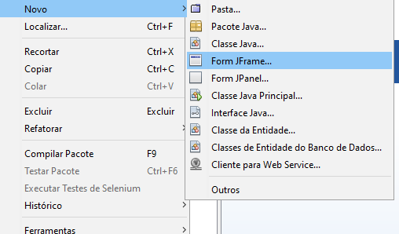
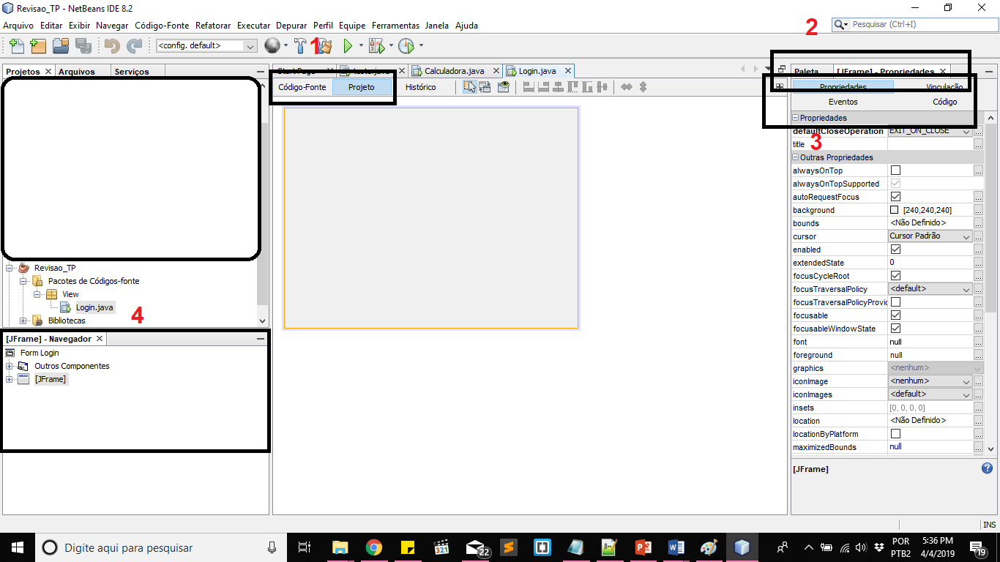
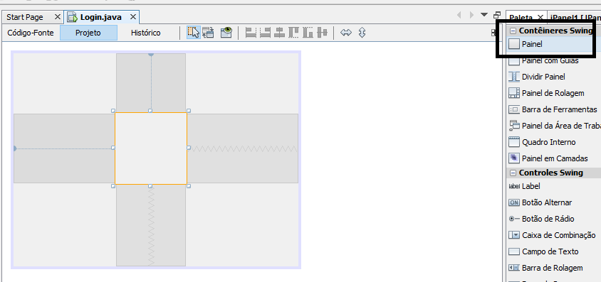
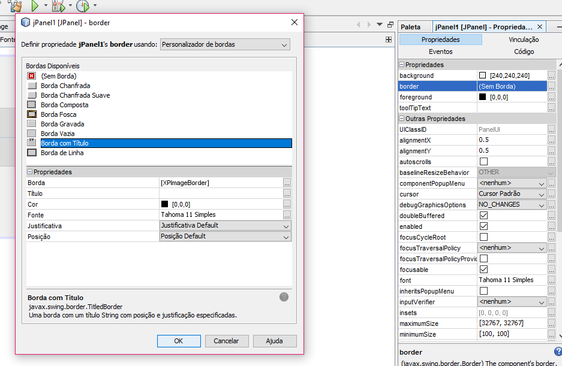
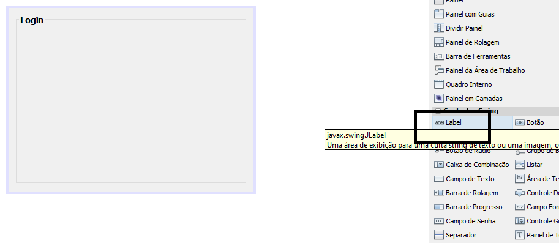
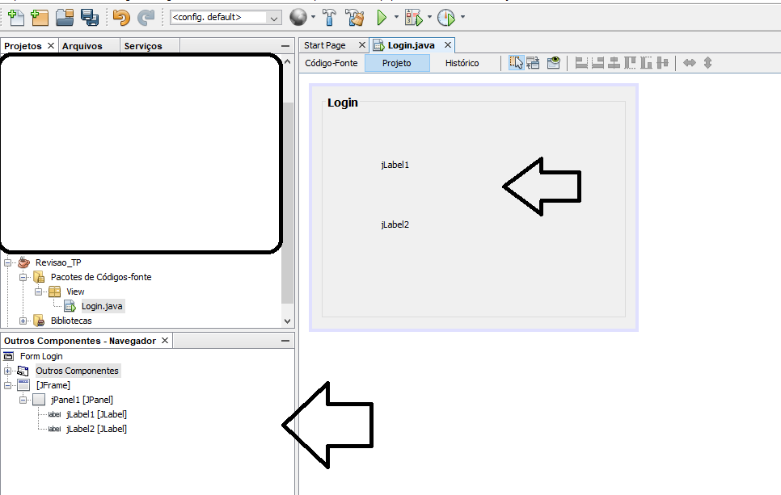
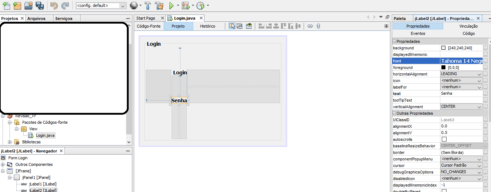

# REVISÃO PROVA 01 - 'Técnicas de Programação' 

**'O difícil é o fácil que não sabemos' - CHEFE AZ**

Este tutorial tem como finalidade auxiliar a fazer o exercício abaixo, explicando alguns pontos específicos para a resolução do exercício abaixo.

## DIVIDIDO EM:
1. **INTERFACE - LOGIN**
2. [AÇÕES INTERFACE - LOGIN](02%20-%20AÇÕES%20INTERFACE%20-%20LOGIN.md)
3. [INTERFACE - CADASTRO](03%20-%20INTERFACE%20-CADASTRO.md)
4. [AÇÕES INTERFACE - CADASTRO](04%20-%20AÇÕES%20DA%20INTERFACE%20-%20CADASTRO.md)
5. [ATALHOS E DICAS](05%20-%20ATALHOS%20e%20DICAS.md)
---
É importante antes de iniciar o Projeto, é entender quais elementos você irá utilizar e inseri-los de forma <strong>Organizada</strong>
Portanto, vou fazer um Check List, que irá dizer quando esta parte estará finalizada

**CHECK LIST 1 - INTERFACE(O QUE ESTAMOS VENDO) DE LOGIN**
- [ ] INSERIR CONTAINER COM O NOME DA BORDA
- [ ] INSERIR ÍCONES E 'USUÁRIO' E 'SENHA'
- [ ] INSERIR INPUTS PARA CADA UM
- [ ] INSERIR BOTÃO 'ENTRAR'
- [ ] DAR NOME AOS BOIS

---

#### Criando um projeto com interface 
Antes de iniciar, é importante criar uma interface Jframe conforme a opção abaixo

#### Funcionalidades Básicas
Ao criar o esta interface, vamos nos atentar a 4 coisas:

1. ABA CÓDIGO / PROJETO
  - Projeto - É a aba que mostra a interface e você adiciona seus elementos de interface.
  - Código - É a aba que você insere seu código, e dá funcionalidades para os elementos da interface.

2.  ABA PALETA / PROPRIEDADE
  - Paleta - Local onde você irá encontrar os elementos da interface, e ao arrasta-los, você irá inseri-los
  - Propriedade - Ao clicar em algum elemento inserido na sua interface, nesta aba você conseguirá modificar certas características.
  
3. ABAS DE PROPRIEDADE DOS ELEMENTOS
  - Navegando por estas abas, você consegue ver diferentes características dos elementos, é importante ter consciência da aba 'propriedades' e 'código'
  
4. NAVEGADOR
  - Janela que você poderá criar uma hierarquia dos elementos e verificá-los.
  
####  INSERINDO CONTAINER COM O NOME DA BORDA

Escolha na aba 'Paleta', a opção abaixo e arraste até sua interface.

Você irá perceber que há um quadrado que é seu container (Painel), que nada mais é que um espaço delimitado que poderá ser modificado.
Vá na aba á direita 'Propriedades' e escolha os '...'(sim, clique nos 3 pontinhos) da opção 'Border' conforme abaixo:

Note que eu selecionei a opção 'Borda com Título' e já foi habilitado em 'Propriedades' para escrever o título da aba.
Preencha com 'Login'.

Com isso, nosso primeiro item da lista foi concluído.

####  INSERINDO USUÁRIO E SENHA

Nesta parte, você não irá inserir um container, e sim controles do Swing.
Conforme abaixo, busque pela opção 'Label', arrastando e jogando na interface dentro do container criado(faça isso 2 vezes - 1 para Login e outro para Senha).

É importante se atentar que foram inserido 3 elementos na nossa interface , portanto no nosso navegador tem 3 elementos além do JFrame (2 Labels e 1 Jpanel).

Clique em cima do Label da interface e aperte 'F2' para Renomea-lo, fazendo isso para os dois Labels, irá ficar assim:

Note que foi alterado o tamanho da fonte e está em negrito.

