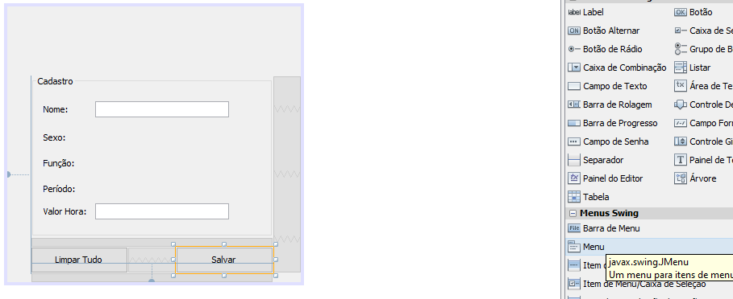
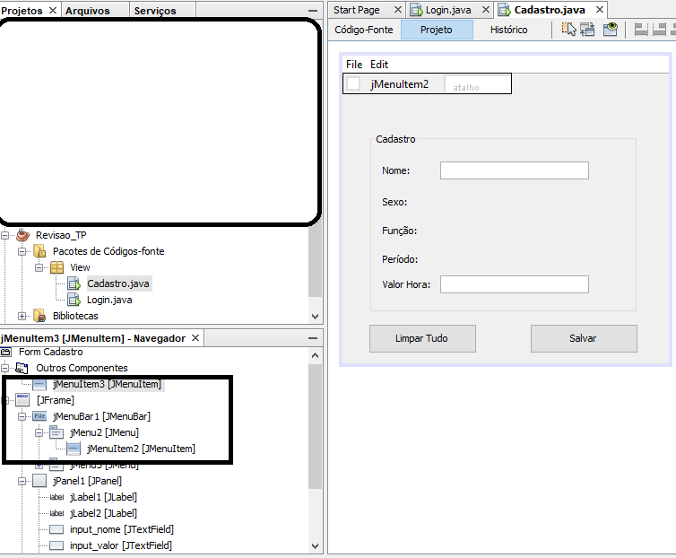
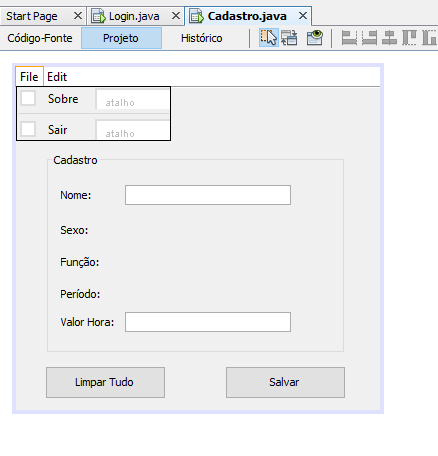
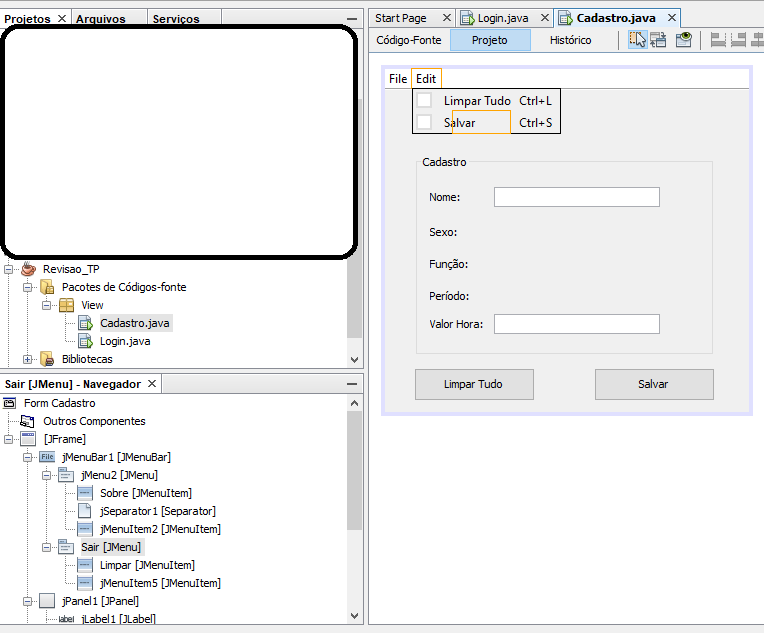
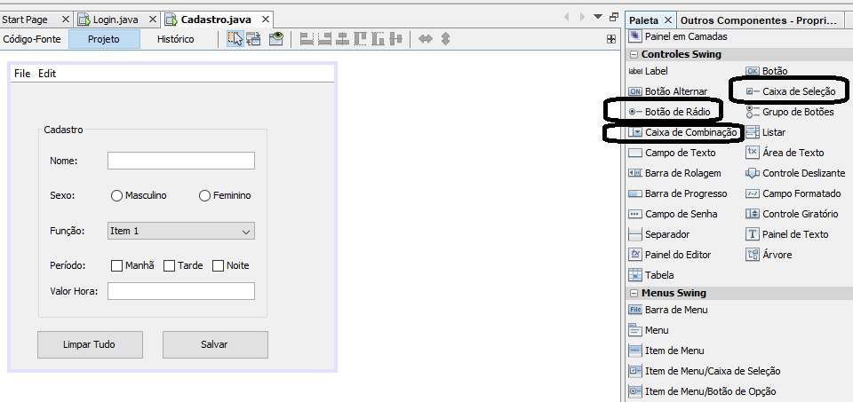
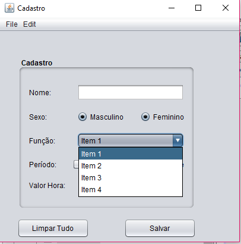
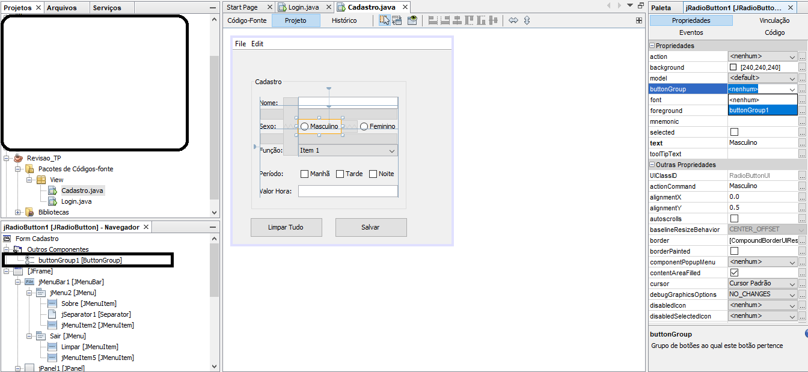
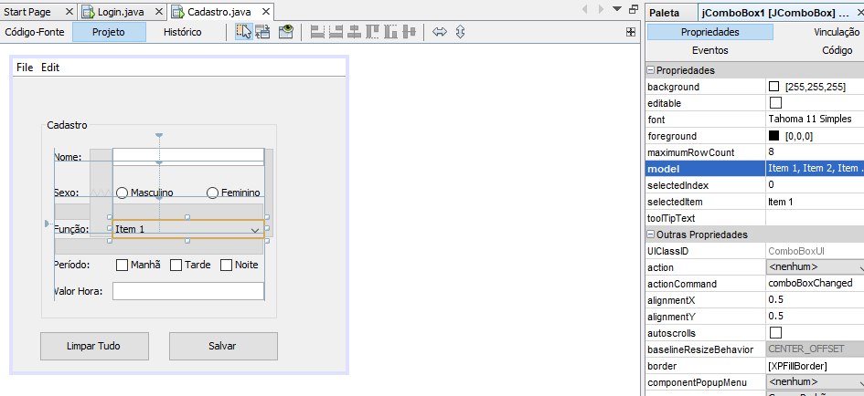
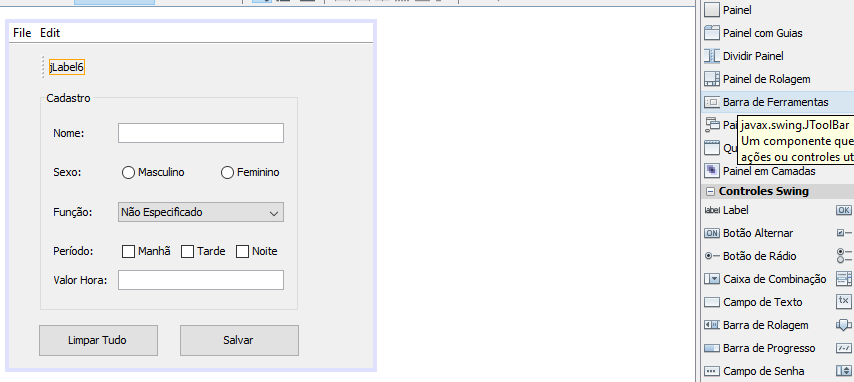
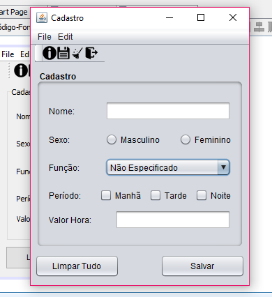

# REVISÃO PROVA 01 - 'Técnicas de Programação' 

**'O difícil é o fácil que não sabemos' - CHEFE AZ**

Este tutorial tem como finalidade auxiliar a fazer o exercício abaixo, explicando alguns pontos específicos para a resolução do exercício abaixo.

## DIVIDIDO EM:
1. [INTERFACE - LOGIN](01%20-%20INTERFACE%20-%20LOGIN.md)
2. [AÇÕES INTERFACE - LOGIN](02%20-%20AÇÕES%20INTERFACE%20-%20LOGIN.md)
3. **INTERFACE - CADASTRO**
4. [AÇÕES INTERFACE - CADASTRO](04%20-%20AÇÕES%20DA%20INTERFACE%20-%20CADASTRO.md)
5. [ATALHOS E DICAS](05%20-%20ATALHOS%20e%20DICAS.md)
---
**CHECK LIST 3 - INTERFACE(O QUE ESTAMOS VENDO) DE CADASTRO**
- [ ] MENU SUSPENSO COM 2 OPÇÕES - 'ARQUIVO' E 'EDITAR'
- [ ] BARRA DE MENU COM ICONES - ABOUT - SAVE - CLEAR - EXIT
- [ ] LABELS: NOME - SEXO - FUNÇÃO - PERÍODO - VALOR HORA
- [ ] INPUTS: NOME - VALOR HORA
- [ ] INPUTS RADIO: MASC - FEMIN
- [ ] CHECK BOX: MANHÃ - TARDE - NOITE
- [ ] BOTÕES: LIMPAR TUDO - SALVAR
- [ ] COMBO BOX
---
### INSERINDO MENUS E BARRA DE MENU

Primeiro, deve se criar um novo JFrame
Inicialmente na paleta a direita, na opção Title, coloque o nome 'Cadastro'

! [Title] (img/14.png)

Com tudo que foi visto até agora, é fácil montar a interface, porém há algumas funcionalidades que faltam:

Acima há a opção 'barra de menu' arrastando e jogando você irá visualizar uma modificação na interface.
Porém ainda não foi adicionado os itens conforme a figura do enunciado. Para isso é necessário arrastar a opção 'item de menu', e ajustar na aba 'navegador' pois a hierarquia irá mostrar onde estão estes itens conforme a figura abaixo:

Portanto parte da interface ficará desta forma abaixo:
Para que seja possível alterar o nome, é só clicar em cima do item e apertar 'F2'.
É importante se atentar a hierarquia dos elementos(barra navegação,posteriormente mostrada)
O elemento 'separador' mostra esta pequena linha separando os nomes.

Para que seja possível inserir os atalhos, é só dar dois cliques onde está escrito 'atalho' e atribuir com o teclado.

Abaixo é mostrado como irá ficar a hierarquia:
Repare que independente dos nomes das variáveis (aba de navegação) o nome que aparece na interface é diferente

Para finalizar a interface em partes, utilize os elementos conforme a figura:

Vamos reparar em 2 coisas:
  1. Se você rodar é possível selecionar Masculino e Feminino ao mesmo tempo
  2. Não há elementos na caixa de seleção(combo box)

Para que seja possível é só arrastar o elemento 'Grupo de Botões' e então selecionar os botões rádios para o mesmo grupo:
(repare que a aba navegação está com o grupo de botões)

Para verificar se está tudo ok, é só rodar novamente e ver se eles se alternam na seleção.

Para conseguir inserir as opções do combo box é só selecionar conforme a imagem abaixo e escrever com quebras de linha as opções:

Para inserir a barra de ferramentas, basta arrastar a opção conforme a figura e inserir os labels.
Como já foi mostrado, é só inserir os ICONS conforme as figuras

Assim, a interface está basicamente finalizada:

Não se esqueça de dar nome aos bois de forma simples.

- [X] MENU SUSPENSO COM 2 OPÇÕES - 'ARQUIVO' E 'EDITAR'
- [x] BARRA DE MENU COM ICONES - ABOUT - SAVE - CLEAR - EXIT
- [x] LABELS: NOME - SEXO - FUNÇÃO - PERÍODO - VALOR HORA
- [x] INPUTS: NOME - VALOR HORA
- [x] INPUTS RADIO: MASC - FEMIN
- [x] CHECK BOX: MANHÃ - TARDE - NOITE
- [x] BOTÕES: LIMPAR TUDO - SALVAR
- [x] COMBO BOX
