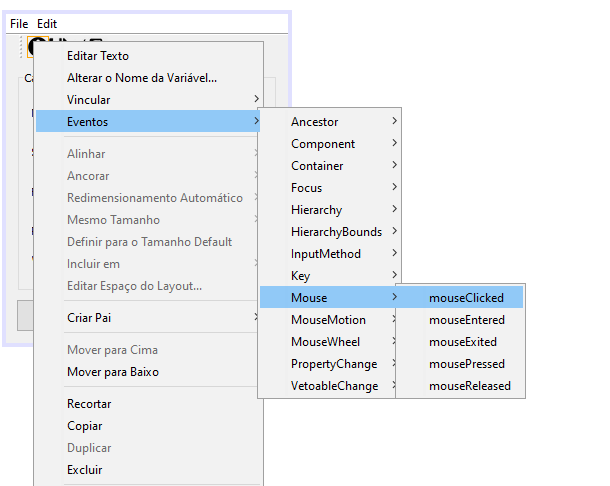

# REVISÃO PROVA 01 - 'Técnicas de Programação' 

**'O difícil é o fácil que não sabemos' - CHEFE AZ**

Este tutorial tem como finalidade auxiliar a fazer o exercício abaixo, explicando alguns pontos específicos para a resolução do exercício abaixo.

## DIVIDIDO EM:
1. [INTERFACE - LOGIN](01%20-%20INTERFACE%20-%20LOGIN.md)
2. [AÇÕES INTERFACE - LOGIN](02%20-%20AÇÕES%20INTERFACE%20-%20LOGIN.md)
3. [INTERFACE - CADASTRO](03%20-%20INTERFACE%20-CADASTRO.md)
4. **AÇÕES INTERFACE - CADASTRO**
5. [ATALHOS E DICAS](05%20-%20ATALHOS%20e%20DICAS.md)
---
**CHECK LIST 1 - INTERFACE(O QUE ESTAMOS VENDO) DE LOGIN**
- [ ] INTERLIGAR A TELA LOGIN COM A TELA DO CADASTRO
- [ ] BOTÃO SALVAR E MENU SUSPENSO SALVAR APARECEREM UMA CAIXA DE DIÁLOGO
- [ ] BOTÃO CLEAN, BOTÃO LIMPAR TUDO E MENU SUSPENSO LIMPAR DEIXAR NO PADRÃO DEFAULT
- [ ] ABOUT E SOBRE MOSTRAR UMA CAIXA DE DIÁLOGO
- [ ] BOTÃO SAIR E MENU SUSPENSO SAIR, SAIR DA TELA

### Inserindo a função de aparecer através da tela de 'login'

Vá para o código da tela login que está atualmente assim:

```
       private void btn_EntrarActionPerformed(java.awt.event.ActionEvent evt) {                                           
        // TODO add your handling code here:
        String login = input_Login.getText();
        String senha = input_Senha.getText();
        
        if(login.equalsIgnoreCase("admin") && senha.equalsIgnoreCase("admin")){
            dispose();
        }else{
            JOptionPane.showMessageDialog(null, "Usuário ou senha Inválido!");
                    
        }
        
    } 

```
    
   É necessário fazer com que se login e senha sejam 'admin',você chame a janela cadastro.
    Isso é possível com a inserção da linha que deixa visível a tela cadastro. 
    
    
```
    private void btn_EntrarActionPerformed(java.awt.event.ActionEvent evt) {                                           
        // TODO add your handling code here:
        String login = input_Login.getText();
        String senha = input_Senha.getText();
        
        if(login.equalsIgnoreCase("admin") && senha.equalsIgnoreCase("admin")){
            dispose();
            new Cadastro().setVisible(true);
        }else{
            JOptionPane.showMessageDialog(null, "Usuário ou senha Inválido!");
                    
        }
        
    }      
```

### Inserindo a função no about
       
   Para que seja possível utilizar os labels como botões, clique com o botão direito conforme a figura abaixo:
   


Indo para o código do botão, você irá ter:

```
    private void aboutMouseClicked(java.awt.event.MouseEvent evt) {                                   
        // TODO add your handling code here:
        JOptionPane.showMessageDialog(null, "Desenvolvido por Takepera!");
    } 

```

O mesmo passo-a-passo pode ser feito para o botão no menu suspenso 'Sobre'

### Inserindo a função no save

Abaixo você irá selecionar:
       O label com ícone de save, atribuir uma ação(botão direito, conforme imagem anteriro) com o mouse (evento click) e utilizar o código abaixo. 
``` 
       JOptionPane.showMessageDialog(null, "Salvo com sucesso!");
```   
Como vimos acima, este código irá abrir uma nova caixa de diálogo e fingir que foi salvo.
Atribua essa função ao botão do menu suspenso e o botão Salvar na interface.

```
    private void saveMouseClicked(java.awt.event.MouseEvent evt) {                                  
        // Utilize este código:
        JOptionPane.showMessageDialog(null, "Salvo com sucesso!");
    }                                 

    private void jButton2ActionPerformed(java.awt.event.ActionEvent evt) {                                         
        // TODO add your handling code here:
        JOptionPane.showMessageDialog(null, "Salvo com sucesso!");
    }   
    
        private void jMenuItem5ActionPerformed(java.awt.event.ActionEvent evt) {                                           
        // TODO add your handling code here:
        JOptionPane.showMessageDialog(null, "Salvo com sucesso!");
    }  
    
```

### Inserindo a função no exit

De forma análoga ao save e about, você irá atribuir um evento ao label Sair:

```
       dispose();
```
Atribua também no menu suspenso e seu código abaixo ficará desta forma:

```
    private void jMenuItem2ActionPerformed(java.awt.event.ActionEvent evt) {                                           
        // TODO add your handling code here:
        dispose();
    }                                          

    private void exitMouseClicked(java.awt.event.MouseEvent evt) {                                  
        // TODO add your handling code here:
        dispose();
    }   
```
